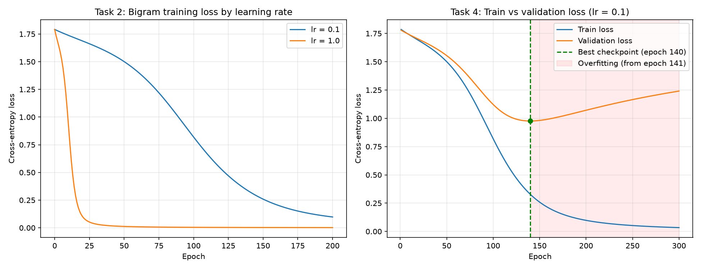

# Attention Lab

A small, transparent mini language-model pipeline written in **NumPy only**, with no PyTorch, TensorFlow, JAX, Hugging Face, pretrained models, or LLM APIs.

```
text representation → model training → self-attention → training diagnostics
```

This isn't meant to be a production LLM. Every step that frameworks hide (tokenisation, embedding lookup, cross-entropy, back-propagation, scaled dot-product attention, checkpoint selection) is written out by hand, so you can inspect it line by line.

## Repository layout

```
.
├── attention_lab.py        # the full pipeline (Tasks 1–4)
├── loss_curve.png          # Task 2 learning-rate curves + Task 4 train/val diagnostics
├── attention_heatmap.png   # Task 3 9×9 attention matrix (bonus visual)
├── requirements.txt
└── README.md
```

## How to run

Requires Python 3.9+.

```bash
pip install -r requirements.txt
python attention_lab.py
```

The script runs start to finish with no manual steps. It prints a report for each task and regenerates `loss_curve.png` and `attention_heatmap.png`. It uses a fixed seed (`np.random.seed(42)`, plus seeded `RandomState` for each initialisation), so the results are fully reproducible. The script asserts every checklist requirement, so it fails loudly if any requirement breaks.

## Data

All data is defined in the `Data` block at the top of `attention_lab.py`:

| Constant | Value | Used by |
|---|---|---|
| `TASK1_TEXT` | `"the cat sat on a mat"` | Task 1 vocabulary, Task 2 & 4 training |
| `VALIDATION_TEXT` | `"a cat sat on a mat"` | Task 4 held-out validation |
| `ATTENTION_SENTENCE` | `"i went to the bank to deposit my money"` | Task 3 |

## What each task does

### Task 1: Text representation
- A whitespace tokenizer lower-cases the text and splits it into tokens.
- The vocabulary maps each unique token to an id in order of first appearance: `{'the': 0, 'cat': 1, 'sat': 2, 'on': 3, 'a': 4, 'mat': 5}`, so **6 tokens**.
- The embedding matrix has shape **(6, 8)**, one 8-dimensional vector per token. An embedding lookup is just row indexing: `E[token_ids]`.

### Task 2: Bigram training
- **Model:** `logits = E[current_token] @ W + b`, then softmax over the 6 tokens to predict the next token.
- **Loss:** cross-entropy. **Gradients:** derived by hand (`softmax − one_hot`, then chain rule back to `W`, `b` and the embedding rows via `np.add.at`).
- Full-batch gradient descent for 200 epochs with **two learning rates**, both starting from identical weights:

| Learning rate | Initial loss | Epoch 50 | Epoch 200 | Reduction |
|---|---|---|---|---|
| 0.1 | 1.7912 | 1.5009 | 0.0978 | 94.5% |
| 1.0 | 1.7912 | 0.0123 | 0.0017 | 99.9% |

The initial loss matches `ln(6) ≈ 1.792`, which is what a model guessing uniformly over 6 tokens should score. That makes it a useful sanity check. After training, the model predicts every next token in the sentence with p ≈ 0.998.

### Task 3: Self-attention
- Task 3 builds **its own vocabulary** (8 unique tokens, since "to" appears twice) and **its own (8, 8) embedding matrix**.
- Sinusoidal positional encodings are added, so the two "to" tokens get different representations.
- Random `W_q`, `W_k`, `W_v` project the input to queries, keys and values, then:
  `Attention(Q, K, V) = softmax(Q Kᵀ / √d_k) · V`
- The result is a **9 × 9 attention matrix** (each row sums to 1) and a (9, 8) contextualised output.

Weights printed for **"bank"**:

| Key | the | deposit | i | went | to (pos 5) | money | to (pos 2) | bank | my |
|---|---|---|---|---|---|---|---|---|---|
| Weight | 0.232 | 0.198 | 0.151 | 0.140 | 0.120 | 0.057 | 0.038 | 0.033 | 0.029 |

The projection matrices are untrained, so these weights show how attention is computed, not what it has learned. Training `W_q`/`W_k` is what would teach "bank" to reliably focus on disambiguating words like "deposit" and "money".

### Task 4: Training diagnostics
The bigram model is retrained (lr = 0.1, 300 epochs) while it's evaluated on the held-out validation text every epoch. Four of the five validation bigrams also appear in training; `a → cat` doesn't, because training only ever sees `a → mat`.

- **Best checkpoint:** the epoch with the lowest validation loss, which is **epoch 140** (val 0.9761, train 0.3280). Its weights are snapshotted, and reloading them reproduces that loss.
- **Possible overfitting point:** the first epoch after which validation loss rises for 5 consecutive epochs while training loss keeps falling, which is **epoch 141**.
- By epoch 300 the training loss is 0.034 but the validation loss has climbed back to 1.241. The model has memorised `a → mat` so confidently that it's heavily penalised on `a → cat`. Early stopping at epoch 140 would have saved 160 epochs and given a better model.



## Checklist

- [x] Task 1 creates a vocabulary of 6 tokens and an embedding matrix of shape (6, 8)
- [x] Task 2 trains with both learning rates and reduces loss
- [x] Task 3 creates its own vocabulary and embeddings for the attention sentence
- [x] Task 3 produces a 9 × 9 attention matrix and prints the weights for "bank"
- [x] Task 4 calculates the best checkpoint and the possible overfitting point
- [x] `loss_curve.png` is generated
- [x] The complete program runs without errors
